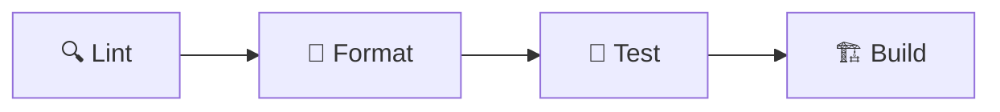

# 🎵 Galeto - Plataforma Multimedia

<div align="center">


**Conecta tus recuerdos con sonidos - Una plataforma donde las imágenes cobran vida a través de la música**

[Características](#características) • [Instalación](#instalación) • [Uso](#uso) • [Testing](#testing) • [Pipeline CI/CD](#pipeline-cicd) • [Documentación](#documentación)

</div>

---

## 📋 Descripción

Galeto es una plataforma web social donde los usuarios pueden asociar canciones a sus fotografías, creando una experiencia multimedia única. Los usuarios registrados pueden subir imágenes, agregar hasta tres canciones por imagen, y recibir likes, comentarios y votos de la comunidad. Los visitantes no registrados pueden navegar la galería en modo solo lectura.

## ✨ Características

### 🔐 Autenticación Segura
- Registro con validación estricta de email (@gmail, @hotmail, @outlook)
- Contraseñas hasheadas con bcrypt
- Autenticación mediante JWT
- Sistema de roles (user/admin)

### 📸 Gestión de Contenido
- Subida de imágenes con preview
- Asociación de hasta 3 canciones por imagen
- Categorización de publicaciones
- Carrusel dinámico mediante manipulación del DOM

### 💬 Interacciones Sociales
- Sistema de likes
- Comentarios en publicaciones
- Votación de canciones (máximo 3 votos por usuario)
- Notificaciones en tiempo real

### 👨‍💼 Panel de Administración
- Eliminación de contenido de usuarios
- Notificaciones automáticas a usuarios afectados
- Control total sobre publicaciones y comentarios

## 🚀 Tecnologías

### Frontend
- **JavaScript Vanilla** - Sin frameworks, manipulación directa del DOM
- **CSS3** - Estilos modernos con fuentes Poppins y Merriweather
- **Vite** - Desarrollo rápido con HMR
- **Webpack** - Build optimizado para producción

### Backend
- **Node.js + Express** - Servidor REST en puerto 4000
- **JWT** - Autenticación stateless
- **Multer** - Manejo de uploads
- **bcrypt** - Hashing de contraseñas
- **CORS** - Seguridad de origen cruzado

### Base de Datos
- **Microsoft SQL Server (MSSQL)** - Base de datos relacional
- **mssql** - Driver nativo para Node.js

### Herramientas de Calidad
- **ESLint** - Linting de código
- **Prettier** - Formateo consistente
- **Jest** - Testing unitario
- **GitHub Actions** - CI/CD automatizado

## 📦 Instalación

### Prerequisitos

- Node.js 18.x o superior
- SQL Server (local o remoto)
- npm o yarn

### 1. Clonar el repositorio

```bash
git clone <url-del-repositorio>
cd Galeto
```

### 2. Instalar dependencias del frontend

```bash
npm install
```

### 3. Instalar dependencias del backend

```bash
cd backend
npm install
cd ..
```

### 4. Configurar la base de datos

1. Abre **SQL Server Management Studio (SSMS)**
2. Ejecuta el script `sql/PicSound.sql` para crear la base de datos `PicsoundDB`
3. Esto creará todas las tablas y relaciones necesarias

### 5. Configurar variables de entorno

Crea un archivo `.env` en la carpeta `backend/`:

```env
# Configuración de Base de Datos
DB_USER=tu_usuario_sql
DB_PASSWORD=tu_contraseña
DB_SERVER=localhost
DB_DATABASE=PicsoundDB
DB_PORT=1433
DB_ENCRYPT=false

# Configuración del Servidor
PORT=4000

# Seguridad
JWT_SECRET=tu_clave_secreta_super_segura_aqui
```

## 🏃‍♂️ Uso

### Desarrollo

#### Iniciar el backend
```bash
cd backend
node index.js
```
El servidor estará disponible en `http://localhost:4000`

#### Iniciar el frontend
```bash
npm run dev
```
La aplicación estará disponible en `http://localhost:5173`

### Producción

#### Generar build de producción
```bash
npm run build
```
Los archivos optimizados se generarán en la carpeta `/dist`

## 🧪 Testing

### Ejecutar tests

```bash
# Ejecutar todos los tests
npm test

# Modo watch (re-ejecuta en cada cambio)
npm run test:watch

# Generar reporte de cobertura
npm run test:coverage
```

### Tests Implementados

1. **validarEmail.test.js** - Validación de emails con dominios permitidos
2. **jwtToken.test.js** - Almacenamiento y gestión de tokens JWT en localStorage

La cobertura de código se genera en `/coverage` y se puede visualizar en HTML.

## 🔄 Pipeline CI/CD

El proyecto incluye un pipeline automatizado que se ejecuta en cada push o pull request a las ramas `main` o `develop`.

### Flujo del Pipeline



#### Jobs del Pipeline

1. **🔍 Lint** - Verifica calidad del código con ESLint
2. **💅 Format** - Valida formateo con Prettier
3. **🧪 Test** - Ejecuta tests unitarios con Jest y genera cobertura
4. **🏗️ Build** - Genera build de producción con Webpack

Cada job:
- Depende del anterior (`needs`)
- Usa Node.js versión 18
- Ejecuta en Ubuntu
- Guarda artefactos (coverage, dist)

### Ver el estado del pipeline

El badge de CI en este README muestra el estado actual. También puedes ver los detalles en la pestaña **Actions** de GitHub.

## 🛠️ Comandos Disponibles

### Desarrollo
```bash
npm run dev          # Inicia servidor de desarrollo
npm run preview      # Preview del build
```

### Calidad de Código
```bash
npm run lint         # Verifica el código
npm run lint:fix     # Corrige problemas automáticamente
npm run format       # Formatea el código
npm run format:check # Verifica formateo sin cambiar
```

### Testing
```bash
npm test             # Ejecuta tests
npm run test:watch   # Modo watch
npm run test:coverage # Con cobertura
```

### Build
```bash
npm run build        # Build de producción
```

## 📁 Estructura del Proyecto

```
Galeto/
├── .github/
│   └── workflows/
│       └── ci.yml              # Pipeline CI/CD
├── backend/
│   ├── index.js                # Servidor Express
│   ├── db.js                   # Configuración MSSQL
│   ├── .env                    # Variables de entorno (no incluir en repo)
│   └── uploads/                # Archivos subidos por usuarios
├── src/
│   ├── app.js                  # Script principal (index.html)
│   ├── main.js                 # Login/Registro
│   ├── category.js             # Categorías
│   ├── detalle_imagen.js       # Detalle de publicación
│   ├── slider.js               # Carrusel
│   └── *.css                   # Estilos
├── tests/
│   ├── setup.js                # Configuración Jest
│   ├── validarEmail.test.js    # Tests validación email
│   ├── jwtToken.test.js        # Tests JWT localStorage
│   └── __mocks__/              # Mocks para tests
├── docs/
│   ├── README.md               # Documentación detallada
│   └── ADMIN_DELETE_FEATURE.md # Doc funcionalidad admin
├── sql/
│   └── PicSound.sql            # Script creación BD
├── dist/                       # Build de producción (generado)
├── .eslintrc.json              # Configuración ESLint
├── .prettierrc                 # Configuración Prettier
├── jest.config.js              # Configuración Jest
├── webpack.config.js           # Configuración Webpack
├── babel.config.json           # Configuración Babel
├── package.json                # Dependencias y scripts
└── README.md                   # Este archivo
```

## 📚 Documentación

La documentación completa del proyecto se encuentra en la carpeta `/docs`:

- **[Documentación Técnica](docs/README.md)** - Arquitectura, Sprints, API Endpoints
- **[Funcionalidad Admin](docs/ADMIN_DELETE_FEATURE.md)** - Detalles del panel de administración

## 🔒 Seguridad

- ✅ Contraseñas hasheadas con bcrypt (10 rounds)
- ✅ Tokens JWT con expiración
- ✅ Validación de email en frontend y backend
- ✅ CORS configurado específicamente
- ✅ Protección contra SQL injection mediante queries parametrizadas
- ✅ Sistema de roles para control de acceso

## 🤝 Contribución

1. Crea un branch desde `develop`
2. Realiza tus cambios
3. Asegúrate de que pase el pipeline:
   ```bash
   npm run lint
   npm run format:check
   npm test
   npm run build
   ```
4. Crea un Pull Request hacia `develop`
5. Espera code review y aprobación

## 📝 Sprints de Desarrollo

El proyecto fue desarrollado siguiendo metodología ágil con 5 sprints:

1. **Sprint 1** - Autenticación y Registro
2. **Sprint 2** - Galería y Publicaciones
3. **Sprint 3** - Interacciones Sociales
4. **Sprint 4** - Panel de Administración
5. **Sprint 5** - Optimización y Testing ✅ (Actual)

Ver [documentación completa de sprints](docs/README.md#sprints-de-desarrollo) para más detalles.

## 📄 Licencia

Este proyecto está bajo la Licencia MIT. Ver archivo LICENSE para más detalles.

## 👥 Autores

Proyecto desarrollado como parte del curso de Construcción y Evolución de Software.

---

<div align="center">

**⭐ Si te gusta este proyecto, dale una estrella en GitHub ⭐**

[Reportar Bug](../../issues) • [Solicitar Feature](../../issues) • [Documentación](docs/README.md)

</div>

```
node index.js
```

### Si todo está correcto, deberías ver en consola:
```
✅ Conectado a SQL Server
🚀 Servidor corriendo en http://localhost:4000
```

# Funcionalidades principales
Registro e inicio de sesión de usuarios

Subida de imágenes con enlaces externos

Asociación de hasta 3 canciones por foto

Likes, comentarios y votos por canción

Roles: usuario, administrador y visitante (solo lectura)

Interacción visual dinámica entre frontend y backend

# Manejo de Usuarios

El sistema implementa tres tipos de usuarios: **administrador**, **usuario registrado** y **usuario no registrado**.

### Usuario no registrado
Al ingresar a la aplicación, este usuario únicamente puede visualizar el **dashboard principal**.  
No tiene permisos para interactuar con el contenido, por lo que **no puede dar “like” ni votar por las canciones**, ni acceder a funcionalidades adicionales.

### Usuario registrado
Este usuario puede **iniciar sesión** y navegar libremente por el **feed**.  
Tiene habilitadas todas las funciones de interacción: reaccionar al contenido, votar y participar dentro de la plataforma.

### Administrador
El administrador (credenciales por defecto: **usuario:** `admin` – **contraseña:** `admin123*`) tiene acceso a un **Panel de Administración** que incluye:

- **Estadísticas Generales**
  - Número de usuarios registrados  
  - Cantidad de imágenes subidas  
  - Total de likes generados  
- **Listado de Usuarios**
  - Visualización del contenido publicado por cada usuario  
  - Reacciones asociadas a dicho contenido  
- **Navegación completa del feed**
- **Acceso a su perfil de administrador**


# Autores
Alison Lita - https://github.com/alison2704

Evelin Rocha - https://github.com/EveRocha11

Génesis Vásconez - https://github.com/GenesisDaena
